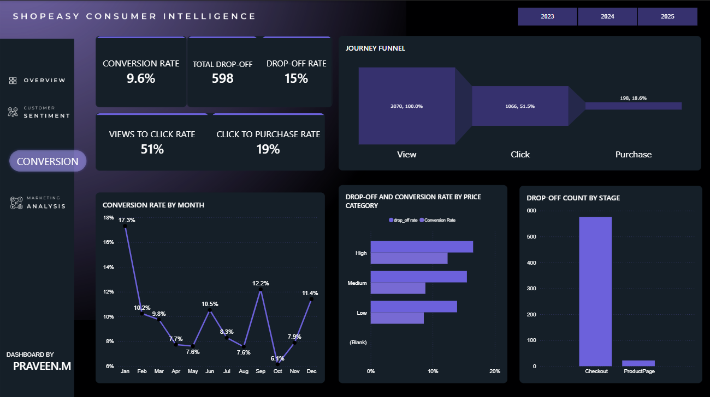

# Consumer Intelligence & Sentiment Analysis Dashboard

> **End-to-end data analytics pipeline** transforming raw retail data into actionable business insights using SQL Server, Python (NLP), and Power BI.


---

## 🔍 Project Overview

This project delivers a full-stack consumer intelligence solution analyzing **customer behavior, conversion funnel performance, marketing effectiveness, and sentiment patterns** across a retail dataset of 10,000+ customer records and reviews.

Using SQL Server for data engineering, Python (VADER/NLTK) for NLP-based sentiment analysis, and Power BI for interactive dashboards, the pipeline surfaces insights that directly support revenue and experience decisions.

**Core business questions answered:**
- Where are customers dropping off in the conversion funnel?
- What are the primary drivers of negative customer sentiment?
- Which products have high engagement but low conversion?
- Which marketing channels and seasons drive the best ROI?

---

## 📊 Dashboard Preview

### Executive Overview


### Conversion Funnel Analysis


### Marketing Performance Analysis


### Customer Sentiment Analysis


---

## 💡 Key Insights

### Conversion Funnel
- Identified **checkout stage as the highest drop-off point**, representing the primary revenue optimization opportunity
- Mapped full customer journey across funnel stages to quantify conversion rates at each step
- Strong early-stage engagement confirmed; bottleneck is concentrated at purchase completion

### Sentiment Analysis
- Classified customer reviews into **positive, negative, and mixed** sentiment categories using VADER
- Extracted top dissatisfaction themes from negative reviews beyond surface-level star ratings
- Sentiment trends revealed hidden quality signals not captured by numeric ratings alone

### Product Performance
- Scored products across **conversion rate, average rating, and sentiment** to build a composite health metric
- Flagged products with high traffic but low conversion for targeted intervention
- Product health scoring enabled prioritized business action

### Marketing Performance
- Analyzed campaign engagement across **multiple channels and seasonal periods**
- Identified peak engagement windows and underperforming channels
- Insights supported smarter budget allocation decisions

---

## 🔧 Project Workflow

### 1. Data Validation & Cleaning — SQL Server
- Data quality audit: completeness, consistency, and accuracy checks
- Duplicate detection and removal
- Null/missing value analysis and treatment
- Data standardization and schema transformation

**Files:** `01.Data_Validation.sql`, `02_cleaning_transformation.sql`

### 2. Sentiment Analysis — Python
- Text preprocessing: tokenization, stopword removal, normalization
- Sentiment classification using **VADER (Valence Aware Dictionary and sEntiment Reasoner)**
- Customer review scoring and theme extraction from negative feedback
- Pandas + NumPy for data manipulation and aggregation

**File:** `03_Sentiment_analysis.ipynb`

### 3. Business Intelligence — Power BI
- Interactive KPI dashboards with slicers and drill-through
- Funnel visualization with stage-by-stage conversion rates
- Product performance scorecards
- Marketing analytics with channel and seasonal breakdowns
- DAX measures for custom business metrics

**File:** `shopeasy_consumer_intelligence.pbix`

---

## 🛠️ Tools & Technologies

| Layer | Tools |
|---|---|
| Data Engineering | SQL Server |
| Data Analysis | Python, Pandas, NumPy |
| NLP / Sentiment | NLTK, VADER Sentiment Analysis |
| Visualization | Power BI, DAX |

---

## 📁 Repository Structure

```
├── 01.Data_Validation.sql
├── 02_cleaning_transformation.sql
├── 03_Sentiment_analysis.ipynb
├── shopeasy_consumer_intelligence.pbix
├── customer_reviews_sentiment.csv
├── negative_reviews_issues.csv
├── image/
│   ├── demo.gif
│   ├── overview.png
│   ├── conversion.png
│   ├── marketing.png
│   └── sentiment.png
└── README.md
```

---

## 🚀 Future Enhancements

- [ ] ML-based sentiment classification (Logistic Regression / BERT) to replace rule-based VADER
- [ ] Predictive customer churn modeling
- [ ] Automated ETL pipeline with scheduling
- [ ] Real-time Power BI dashboard integration
- [ ] Product recommendation system

---

## 👤 Author

**Abhishek Mishra**
B.Tech CSE (Artificial Intelligence) | Babu Banarasi Das University, Lucknow

[](https://linkedin.com/in/your-profile)
[](https://github.com/Abhishek-9090)
[](https://your-portfolio-link)

---

*Built with SQL Server, Python, NLP, and Power BI to convert raw customer behavior data into strategic business intelligence.*
